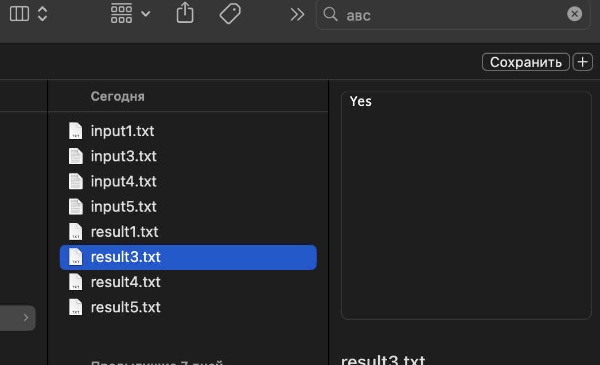
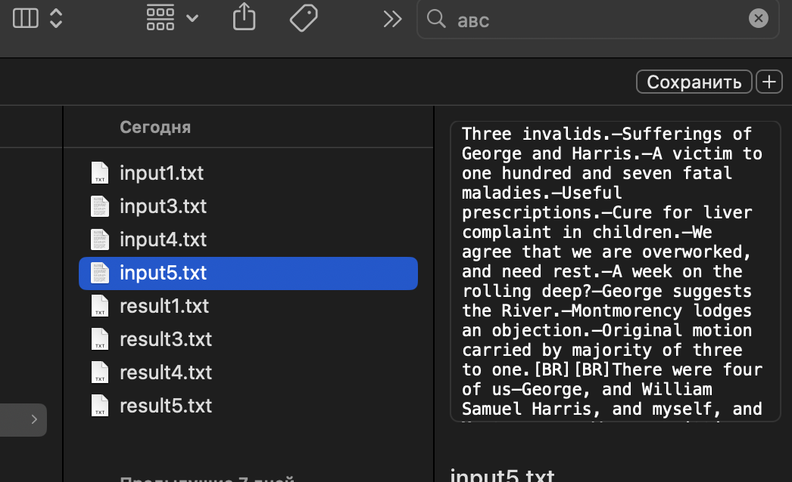

Отчет

Прозорский Михаил Алексеевич

БПИ224

Вариант 15

Разработать программу, которая на основе заданной ASCII-строки символов, решает вопрос, является ли данная строка палиндромом.

Так как особых требований не было, то я взял с Википедии следующее определение палиндрома:

Палиндромом называют любой симметричный набор символов.

Поэтому в моем решении ответ на заданный вопрос зависит и от разделительных знаков.

Работа выполнялась на 10 баллов

Основная программа лежит в папке main

Тестовая в папке test

В тестовой программе заранее прописаны абсолютные пути файлов, поэтому для запуска тестовой программы требуется изменить в коде пути к файлам у себя на компьютере.

Диалоговое графическое окно:

Вывод в консоль:

Тесты:

Тестовая программа:

При вводе некоректных данных и при выходе из программы она выдаёт ошибку в графическом окне и завершается:

